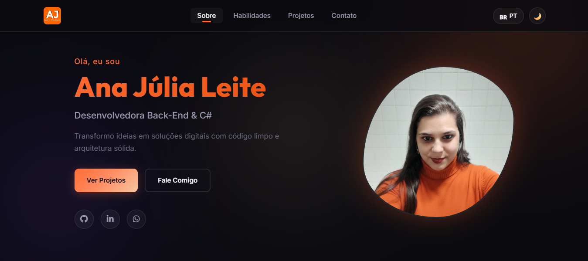

# Meu Portifólio

Este é o meu portifólio pessoal e profissional que estarei compartilhando no meu Linkedin. Este é mais um projeto para mostrar um pouco mais do meu trabalho. Entre em contato que também faço o seu!

O site foi totalmente construído com a linguagem de marcação HTML5, com folhas de estilização no CSS3 e com alguns efeitos de animação feitos em JavaScrip.
 
Usei o validador de HTML para construir o meu portifólio e todas as páginas de forma válidas por ele.

## Demonstração

## Links úteis

  
Link do <a href= "https://validator.w3.org/">Validador</a>

## License

